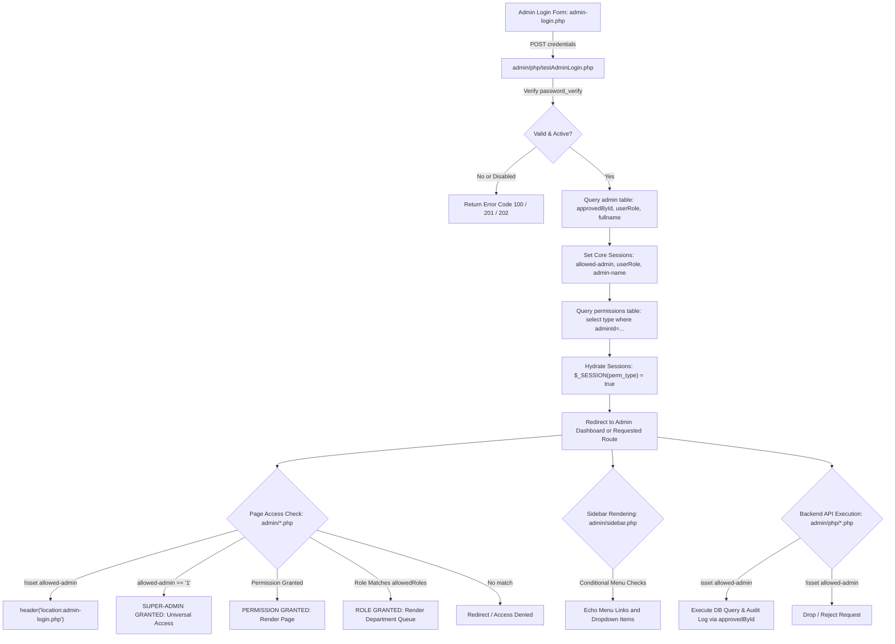
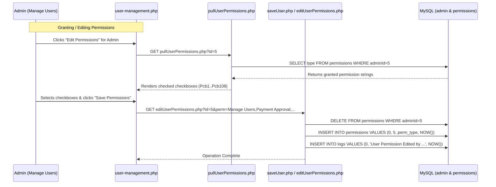

# Ad Astra Admin Permissions & Authorization Specification

This specification provides a complete architectural reference for the administrative permissions system, role-based access control (RBAC), authentication lifecycle, and exact code inspection points across the entire **Ad Astra Admin Portal** (`admin/`).

---

## 1. Executive Summary & Authorization Architecture

The Ad Astra Admin Portal employs a **three-tier authorization hierarchy**:
1. **Super-Admin Bypass**: An administrator with primary key `approvedById = "1"` in table `admin` bypasses every permission check in the application.
2. **Role-Based Access Control (RBAC)**: Stored in column `admin.userRole` (and session key `$_SESSION['userRole']`). Used primarily to isolate committee-specific applicant evaluation queues (`ADEd`, `ConEd`, `CSEd`, `MarketEd`, `PhotoEd`, `VidEd`, `WebEd`) and executive queues (`EIC`, `ManEd`, `CD`, `AE`), while explicitly restricting `Staffer`.
3. **Granular Permission Flags (Table `permissions`)**: Fine-grained string privileges (e.g., `Payment Approval`, `Manage Users`, `Write Up Approval`) populated from table `permissions` into boolean session variables `$_SESSION['<Permission Name>'] = true`.



---

## 2. Authentication & Session Lifecycle

### Database Schemas
The authorization subsystem relies on three relational tables in the database (connected via `conn2025` in [connect.php](file:///Users/lei/Downloads/adastra/manualtest/admin/connect.php)):

#### Table `admin`
Stores administrative user accounts and organizational roles:
| Column | Type | Description |
| :--- | :--- | :--- |
| `approvedById` | `INT AUTO_INCREMENT PRIMARY KEY` | Unique Admin ID (User ID `1` is the Super-Admin) |
| `username` | `VARCHAR(255)` | Login identifier |
| `fullname` | `VARCHAR(255)` | Full name displayed on UI header ([sidebar.php:L28](file:///Users/lei/Downloads/adastra/manualtest/admin/sidebar.php#L28)) |
| `password` | `VARCHAR(255)` | Bcrypt hash generated via `password_hash()` |
| `status` | `VARCHAR(50)` | `Active` or `Disabled` |
| `userRole` | `VARCHAR(50)` | Editorial or staff role (e.g., `EIC`, `ManEd`, `ADEd`, `Staffer`) |
| `last_login` | `DATETIME` | Timestamp of latest successful authentication |

#### Table `permissions`
Stores assigned privileges as individual rows per administrator:
| Column | Type | Description |
| :--- | :--- | :--- |
| `id` | `INT AUTO_INCREMENT PRIMARY KEY` | Permission entry ID |
| `adminId` | `INT` | Foreign key referencing `admin.approvedById` |
| `type` | `VARCHAR(255)` | Exact permission string matching `$_SESSION['<type>']` |
| `date_created` / timestamp | `DATETIME` | Timestamp when the permission was granted |

#### Table `logs`
Stores the administrative audit trail:
| Column | Type | Description |
| :--- | :--- | :--- |
| `id` | `INT AUTO_INCREMENT PRIMARY KEY` | Log entry ID |
| `action` | `TEXT` | Log message string detailing the action and admin ID |
| `date` | `DATETIME` | Timestamp (`NOW()`) |

---

### Authentication Handshake: [admin/php/testAdminLogin.php](file:///Users/lei/Downloads/adastra/manualtest/admin/php/testAdminLogin.php)
When an administrator logs in, the authentication script executes the following verification and session hydration sequence ([testAdminLogin.php:L1-L32](file:///Users/lei/Downloads/adastra/manualtest/admin/php/testAdminLogin.php#L1-L32)):

```php
// 1. Audit login attempt
$conn2025->query("insert into logs values(0,'Tried to Admin Log In : {$_GET['un']}',NOW())");

// 2. Fetch admin account
$result = $conn2025->query("select approvedById,password,fullname,status, userRole from admin where username='{$_GET['un']}' limit 1");

if($result->num_rows > 0){
    while($row = $result->fetch_assoc()){
        if($row['status'] == "Disabled"){
            echo "100"; // Account disabled
        } else if(password_verify($_GET['pass'], $row['password'])){
            // 3. Log success and update last login
            $conn2025->query("insert into logs values(0,'Admin Logged In : {$_GET['un']}',NOW())");
            $conn2025->query("update admin set last_login=NOW() where approvedById='{$row['approvedById']}'");
            
            // 4. Initialize Core Session Variables
            $_SESSION['allowed-admin'] = $row['approvedById'];
            $_SESSION['admin-name']    = $row['fullname'];
            $_SESSION['userRole']      = $row['userRole'];

            // 5. Query and Hydrate Granular Permissions into $_SESSION
            $perms = $conn2025->query("select type from permissions where adminId='{$row['approvedById']}'");
            if($perms->num_rows > 0){
                while($perm = $perms->fetch_assoc()){
                    $_SESSION[$perm['type']] = true;
                }
            }
            echo "200"; // Login OK
        } else {
            echo "201"; // Invalid Password
        }
    }
} else {
    echo "202"; // User not found
}
```

---

## 3. The Super-Admin Universal Override

Across the entire administrative suite, User ID `1` (`$_SESSION['allowed-admin'] == "1"`) acts as the **Root Super-Admin**.

### The Universal Guard Pattern
Virtually all admin pages employ the following compound evaluation at lines 1–10:
```php
session_start();
if (!isset($_SESSION['allowed-admin'])) {
    header("location:admin-login.php");
} else if ((isset($_SESSION['<Permission Name>']) && $_SESSION['<Permission Name>']) || $_SESSION['allowed-admin'] == "1") {
    // Access Granted: Execute Page Code
}
```

### Implications:
- Any user whose `approvedById` is `1` automatically passes all permission checks, even if no records exist for them in the `permissions` table.
- **Legacy Quirk**: In [admin/schedule-manager-php/updateDisplayTable2.php:L4](file:///Users/lei/Downloads/adastra/manualtest/admin/schedule-manager-php/updateDisplayTable2.php#L4), access is checked against `$_SESSION['allowed-admin'] == "2"` instead of `"1"`.

---

## 4. Role-Based Access Control (RBAC) & Editorial Hierarchy

In addition to granular permissions, the system evaluates the user's organizational role from `$_SESSION['userRole']` (or aliased as `$_SESSION['role']`).

### Defined Roles in the System
| Role Code | Title / Department | Access Privileges & Dedicated Queues |
| :--- | :--- | :--- |
| **`EIC`** | Editor-in-Chief | Universal editorial approval, applicant review, partnership viewing |
| **`ManEd`** | Managing Editor | Management approval, applicant evaluation queue |
| **`CD`** | Creative Director | Creative approvals, design and applicant evaluation queue |
| **`AE`** | Associate Editor | Editorial applicant evaluation queue |
| **`ADEd`** | Art & Design Editor | Dedicated applicant queue: [browse-a&d.php](file:///Users/lei/Downloads/adastra/manualtest/admin/browse-a&d.php) |
| **`ConEd`** | Content Development Editor | Dedicated applicant queue: [browse-condev.php](file:///Users/lei/Downloads/adastra/manualtest/admin/browse-condev.php) |
| **`CSEd`** | Customer Support Editor | Dedicated applicant queue: [browse-cs.php](file:///Users/lei/Downloads/adastra/manualtest/admin/browse-cs.php) |
| **`MarketEd`** | Marketing Editor | Dedicated applicant queue: [browse-marketing.php](file:///Users/lei/Downloads/adastra/manualtest/admin/browse-marketing.php) |
| **`PhotoEd`** | Photo Editor | Dedicated applicant queue: [browse-photo.php](file:///Users/lei/Downloads/adastra/manualtest/admin/browse-photo.php) |
| **`VidEd`** | Video Editor | Dedicated applicant queue: [browse-video.php](file:///Users/lei/Downloads/adastra/manualtest/admin/browse-video.php) |
| **`WebEd`** | Web Development Editor | Dedicated applicant queue: [browse-webdev.php](file:///Users/lei/Downloads/adastra/manualtest/admin/browse-webdev.php) |
| **`Staffer`** | General Staff | Restricted: explicitly blocked from applicant evaluation menus in [sidebar.php:L449](file:///Users/lei/Downloads/adastra/manualtest/admin/sidebar.php#L449) |

### Exact Code Checkpoints for Roles:
1. **Applicant Menu Restriction in [admin/sidebar.php:L449-L505](file:///Users/lei/Downloads/adastra/manualtest/admin/sidebar.php#L449-L505)**:
   ```php
   if((isset($_SESSION['Browse 3T']) || $_SESSION['allowed-admin']) && $_SESSION['userRole'] != "Staffer"){
       if($_SESSION['userRole'] == "ADEd")     echo '<a href="browse-a&d.php"...>Art & Design</a>';
       if($_SESSION['userRole'] == "ConEd")    echo '<a href="browse-condev.php"...>Content Development</a>';
       if($_SESSION['userRole'] == "CSEd")     echo '<a href="browse-cs.php"...>Customer Support</a>';
       if($_SESSION['userRole'] == "MarketEd") echo '<a href="browse-marketing.php"...>Marketing</a>';
       if($_SESSION['userRole'] == "PhotoEd")  echo '<a href="browse-photo.php"...>Photo</a>';
       if($_SESSION['userRole'] == "VidEd")    echo '<a href="browse-video.php"...>Video</a>';
       if($_SESSION['userRole'] == "WebEd")    echo '<a href="browse-webdev.php"...>Web Development</a>';
       if($_SESSION['userRole'] == "EIC") { /* Full Editorial Queue Links */ }
       if($_SESSION['userRole'] == "ManEd") { /* Managing Queue Links */ }
       if($_SESSION['userRole'] == "CD") { /* Creative Queue Links */ }
       if($_SESSION['userRole'] == "AE") { /* Associate Queue Links */ }
   }
   ```
2. **Applicant Evaluation Gate in [admin/browse_applicants_3T.php:L7](file:///Users/lei/Downloads/adastra/manualtest/admin/browse_applicants_3T.php#L7)**:
   ```php
   } else if (in_array($_SESSION['userRole'], ["EIC", "ManEd", "CD", "AE", "ADEd"]) || $_SESSION['allowed-admin'] == "1") {
       // Permitted to browse cross-departmental 3T applicants
   }
   ```
3. **Partnership & Main Website Role Gates in [admin/view-partnership.php:L8-L13](file:///Users/lei/Downloads/adastra/manualtest/admin/view-partnership.php#L8-L13) and [admin/sidebar.php:L674-L680](file:///Users/lei/Downloads/adastra/manualtest/admin/sidebar.php#L674-L680)**:
   ```php
   $allowedRoles = ["ADEd", "ConEd", "CSEd", "MarketEd", "PhotoEd", "VidEd", "WebEd", "EIC"];
   if (isset($_SESSION['Manage Main Website']) || $_SESSION['allowed-admin'] == "1" || (isset($_SESSION['role']) && in_array($_SESSION['role'], $allowedRoles))) {
       // Render website directories and partnership forms
   }
   ```

---

## 5. Master Permissions Registry & Matrix Table

This table details all **52 permission keys** managed in the database, their checkbox identifiers in the administrative user management interface ([admin/user-management.php](file:///Users/lei/Downloads/adastra/manualtest/admin/user-management.php) & [admin/php/pullUserPermissions.php](file:///Users/lei/Downloads/adastra/manualtest/admin/php/pullUserPermissions.php)), and where each permission is enforced.

| # | Permission String (`permissions.type`) | Category | Add Checkbox ID | Edit Checkbox ID | Enforced In Pages | Enforced In Sidebar? | Purpose & Scope |
| :--- | :--- | :--- | :--- | :--- | :--- | :--- | :--- |
| 1 | **`Manage Users`** | General Management | `#cb4` | `#Pcb4` | [user-management.php](file:///Users/lei/Downloads/adastra/manualtest/admin/user-management.php), [manage-schedules.php](file:///Users/lei/Downloads/adastra/manualtest/admin/manage-schedules.php), [manage-schedules-online.php](file:///Users/lei/Downloads/adastra/manualtest/admin/manage-schedules-online.php), [schedules.php](file:///Users/lei/Downloads/adastra/manualtest/admin/schedules.php) | Yes ([sidebar.php:L712](file:///Users/lei/Downloads/adastra/manualtest/admin/sidebar.php#L712)) | Admin user accounts, role assignment, password resets |
| 2 | **`Manage Main Website`** | General Management | `#cb46` | `#Pcb46` | [view-partnership.php](file:///Users/lei/Downloads/adastra/manualtest/admin/view-partnership.php), [directory-announcements.php](file:///Users/lei/Downloads/adastra/manualtest/admin/directory-announcements.php), [directory-campaign.php](file:///Users/lei/Downloads/adastra/manualtest/admin/directory-campaign.php), [directory-office.php](file:///Users/lei/Downloads/adastra/manualtest/admin/directory-office.php), [directory-ontrack.php](file:///Users/lei/Downloads/adastra/manualtest/admin/directory-ontrack.php), [directory-projects.php](file:///Users/lei/Downloads/adastra/manualtest/admin/directory-projects.php), [directory-recruitment.php](file:///Users/lei/Downloads/adastra/manualtest/admin/directory-recruitment.php), [directory-segments.php](file:///Users/lei/Downloads/adastra/manualtest/admin/directory-segments.php), [directory-yearbook.php](file:///Users/lei/Downloads/adastra/manualtest/admin/directory-yearbook.php) | Yes ([sidebar.php:L677](file:///Users/lei/Downloads/adastra/manualtest/admin/sidebar.php#L677)) | Main website directory posts, news, office articles |
| 3 | **`File Manager`** | General Management | `#cb5` | `#Pcb5` | Protected in sidebar routing | Yes ([sidebar.php:L723](file:///Users/lei/Downloads/adastra/manualtest/admin/sidebar.php#L723)) | Access to filesystem uploads and document repository |
| 4 | **`Admin Logs`** | General Management | `#cb6` | `#Pcb6` | [browse-logs.php](file:///Users/lei/Downloads/adastra/manualtest/admin/browse-logs.php) | Yes ([sidebar.php:L767](file:///Users/lei/Downloads/adastra/manualtest/admin/sidebar.php#L767)) | View administrative audit log stream |
| 5 | **`Browse 3T`** | General Management | `#cb108` | `#Pcb108` | [browse-applicants.php](file:///Users/lei/Downloads/adastra/manualtest/admin/browse-applicants.php), [browse_applicants_1T2324.php](file:///Users/lei/Downloads/adastra/manualtest/admin/browse_applicants_1T2324.php), [browse_applicants_1T2425.php](file:///Users/lei/Downloads/adastra/manualtest/admin/browse_applicants_1T2425.php), [browse_applicants_1T2526.php](file:///Users/lei/Downloads/adastra/manualtest/admin/browse_applicants_1T2526.php), [browse_applicants_2T2425.php](file:///Users/lei/Downloads/adastra/manualtest/admin/browse_applicants_2T2425.php), [browse_applicants_2T2526.php](file:///Users/lei/Downloads/adastra/manualtest/admin/browse_applicants_2T2526.php), [browse_applicants_3T2425.php](file:///Users/lei/Downloads/adastra/manualtest/admin/browse_applicants_3T2425.php), [browse_applicants_3T2526.php](file:///Users/lei/Downloads/adastra/manualtest/admin/browse_applicants_3T2526.php), [evaluate.php](file:///Users/lei/Downloads/adastra/manualtest/admin/evaluate.php), [evaluate_v1.php](file:///Users/lei/Downloads/adastra/manualtest/admin/evaluate_v1.php) | Yes ([sidebar.php:L438](file:///Users/lei/Downloads/adastra/manualtest/admin/sidebar.php#L438)) | Recruitment applicant evaluation & interview scoring |
| 6 | **`Concerns`** | General Management | `#cb104` | `#Pcb104` | [concerns.php](file:///Users/lei/Downloads/adastra/manualtest/admin/concerns.php) | Yes ([sidebar.php:L386](file:///Users/lei/Downloads/adastra/manualtest/admin/sidebar.php#L386)) | Student inquiries, complaints, and ticket resolution |
| 7 | **`Ad Astra 2025`** | Subscribers | `#cb49` | `#Pcb49` | [browse-2025.php](file:///Users/lei/Downloads/adastra/manualtest/admin/browse-2025.php), [browse-2025-v2.php](file:///Users/lei/Downloads/adastra/manualtest/admin/browse-2025-v2.php), [browse-2026.php](file:///Users/lei/Downloads/adastra/manualtest/admin/browse-2026.php), [browse-2027.php](file:///Users/lei/Downloads/adastra/manualtest/admin/browse-2027.php) | Submenu filter | Browse subscribers for 2025, 2026, and 2027 editions |
| 8 | **`Ad Astra 2024`** | Subscribers | `#cb42` | `#Pcb42` | [browse-2024.php](file:///Users/lei/Downloads/adastra/manualtest/admin/browse-2024.php) | Submenu filter | Browse subscribers for 2024 edition |
| 9 | **`Ad Astra 2023`** | Subscribers | `#cb28` | `#Pcb28` | [browse-2023.php](file:///Users/lei/Downloads/adastra/manualtest/admin/browse-2023.php) | Submenu filter | Browse subscribers for 2023 edition |
| 10 | **`Browse Subscribers`** | Subscribers | `#cb3` | `#Pcb3` | [browse.php](file:///Users/lei/Downloads/adastra/manualtest/admin/browse.php), [browse-schedule.php](file:///Users/lei/Downloads/adastra/manualtest/admin/browse-schedule.php), [browse-schedule-online.php](file:///Users/lei/Downloads/adastra/manualtest/admin/browse-schedule-online.php), [browse-ticket-2027.php](file:///Users/lei/Downloads/adastra/manualtest/admin/browse-ticket-2027.php) | Yes ([sidebar.php:L315](file:///Users/lei/Downloads/adastra/manualtest/admin/sidebar.php#L315)) | General subscriber directory (FRAGMENT 2021-2022) |
| 11 | **`CLASSIC Subscribers`** | Subscribers | `#cb19` | `#Pcb19` | [browse-classic-subscribers.php](file:///Users/lei/Downloads/adastra/manualtest/admin/browse-classic-subscribers.php) | Submenu filter | CLASSIC (2018) yearbook subscriber roster |
| 12 | **`DIMENSIONS Subscribers`** | Subscribers | `#cb20` | `#Pcb20` | [browse-dimensions-subscribers.php](file:///Users/lei/Downloads/adastra/manualtest/admin/browse-dimensions-subscribers.php) | Submenu filter | DIMENSIONS (2017) yearbook subscriber roster |
| 13 | **`LUXEO Subscribers`** | Subscribers | `#cb11` | `#Pcb11` | [browse-luxeo-subscribers.php](file:///Users/lei/Downloads/adastra/manualtest/admin/browse-luxeo-subscribers.php) | Submenu filter | LUXEO (2020) yearbook subscriber roster |
| 14 | **`OBRA Subscribers`** | Subscribers | `#cb12` | `#Pcb12` | [browse-obra-subscribers.php](file:///Users/lei/Downloads/adastra/manualtest/admin/browse-obra-subscribers.php) | Submenu filter | OBRA (2019) yearbook subscriber roster |
| 15 | **`PROJECTION Subscribers`** | Subscribers | `#cb21` | `#Pcb21` | [browse-projection-subscribers.php](file:///Users/lei/Downloads/adastra/manualtest/admin/browse-projection-subscribers.php) | Submenu filter | PROJECTION (2016) yearbook subscriber roster |
| 16 | **`Browse Payments`** | Payments & Financial | `#cb10` | `#Pcb10` | [browse-payments.php](file:///Users/lei/Downloads/adastra/manualtest/admin/browse-payments.php) | Yes ([sidebar.php:L364](file:///Users/lei/Downloads/adastra/manualtest/admin/sidebar.php#L364)) | Master subscriber payment overview |
| 17 | **`Browse 2024 Payments`** | Payments & Financial | `#cb44` | `#Pcb44` | [browse-2024-payments.php](file:///Users/lei/Downloads/adastra/manualtest/admin/browse-2024-payments.php) | Submenu filter | 2024 yearbook payment transactions |
| 18 | **`Browse 2023 Payments`** | Payments & Financial | `#cb29` | `#Pcb29` | [browse-2023-payments.php](file:///Users/lei/Downloads/adastra/manualtest/admin/browse-2023-payments.php) | Submenu filter | 2023 yearbook payment transactions |
| 19 | **`CLASSIC Payments`** | Payments & Financial | `#cb24` | `#Pcb24` | [browse-classic-payments.php](file:///Users/lei/Downloads/adastra/manualtest/admin/browse-classic-payments.php) | Submenu filter | CLASSIC payment records |
| 20 | **`DIMENSIONS Payments`** | Payments & Financial | `#cb47` | `#Pcb47` | Database registered permission | Submenu filter | DIMENSIONS payment records |
| 21 | **`LUXEO Payments`** | Payments & Financial | `#cb22` | `#Pcb22` | [browse-luxeo-payments.php](file:///Users/lei/Downloads/adastra/manualtest/admin/browse-luxeo-payments.php) | Submenu filter | LUXEO payment records |
| 22 | **`OBRA Payments`** | Payments & Financial | `#cb23` | `#Pcb23` | [browse-obra-payments.php](file:///Users/lei/Downloads/adastra/manualtest/admin/browse-obra-payments.php) | Submenu filter | OBRA payment records |
| 23 | **`PROJECTION Payments`** | Payments & Financial | `#cb48` | `#Pcb48` | Database registered permission | Submenu filter | PROJECTION payment records |
| 24 | **`Browse 2024 Proof`** | Payments & Financial | `#cb43` | `#Pcb43` | [browse-2024-proof.php](file:///Users/lei/Downloads/adastra/manualtest/admin/browse-2024-proof.php) | Yes ([sidebar.php:L348](file:///Users/lei/Downloads/adastra/manualtest/admin/sidebar.php#L348)) | Uploaded proof of payment receipts |
| 25 | **`Ad Astra 2023 Ticket`** | Payments & Financial | `#cb27` | `#Pcb27` | [browse-ticket-2023.php](file:///Users/lei/Downloads/adastra/manualtest/admin/browse-ticket-2023.php) *(checks 'Ad Astra 2024 Tickets')* | Yes ([sidebar-og.php:L298](file:///Users/lei/Downloads/adastra/manualtest/admin/sidebar-og.php#L298)) | Claiming ticket validation |
| 26 | **`Browse Claiming`** | Payments & Financial | `#cb40` | `#Pcb40` | [browse-claiming.php](file:///Users/lei/Downloads/adastra/manualtest/admin/browse-claiming.php) | Yes (Commented L272) | Yearbook claiming forms & dispatch |
| 27 | **`Payment Approval`** | Payments & Financial | `#cb1` | `#Pcb1` | [payment-approval.php](file:///Users/lei/Downloads/adastra/manualtest/admin/payment-approval.php), [payment-approval-2025.php](file:///Users/lei/Downloads/adastra/manualtest/admin/payment-approval-2025.php), [payment-approval-2026.php](file:///Users/lei/Downloads/adastra/manualtest/admin/payment-approval-2026.php), [payment-approval-2027.php](file:///Users/lei/Downloads/adastra/manualtest/admin/payment-approval-2027.php), [scheduling.php](file:///Users/lei/Downloads/adastra/manualtest/admin/scheduling.php), [second-payment.php](file:///Users/lei/Downloads/adastra/manualtest/admin/second-payment.php) | Yes ([sidebar.php:L82](file:///Users/lei/Downloads/adastra/manualtest/admin/sidebar.php#L82)) | Approve or reject subscriber payments |
| 28 | **`Proof Approval`** | Payments & Financial | `#cb41` | `#Pcb41` | [proof-approval.php](file:///Users/lei/Downloads/adastra/manualtest/admin/proof-approval.php), [proof-approval-2025.php](file:///Users/lei/Downloads/adastra/manualtest/admin/proof-approval-2025.php), [proof-approval-2026.php](file:///Users/lei/Downloads/adastra/manualtest/admin/proof-approval-2026.php), [proof-approval-2027.php](file:///Users/lei/Downloads/adastra/manualtest/admin/proof-approval-2027.php) | Yes ([sidebar.php:L65](file:///Users/lei/Downloads/adastra/manualtest/admin/sidebar.php#L65)) | Verification queue for bank deposit & GCash slips |
| 29 | **`Second Payment Request`** | Payments & Financial | `#cb7` | `#Pcb7` | Database registered permission | Yes (Commented L305) | Requests for second installment payments |
| 30 | **`Transfers`** | Transfers & Refunds | `#cb39` | `#Pcb39` | [browse-transfer.php](file:///Users/lei/Downloads/adastra/manualtest/admin/browse-transfer.php), [browse-transfer-2025.php](file:///Users/lei/Downloads/adastra/manualtest/admin/browse-transfer-2025.php), [browse-transfer-2026.php](file:///Users/lei/Downloads/adastra/manualtest/admin/browse-transfer-2026.php), [browse-transfer-2027.php](file:///Users/lei/Downloads/adastra/manualtest/admin/browse-transfer-2027.php), [dashboard.php](file:///Users/lei/Downloads/adastra/manualtest/admin/dashboard.php) | Yes ([sidebar.php:L146](file:///Users/lei/Downloads/adastra/manualtest/admin/sidebar.php#L146)) | Subscription package transfer records |
| 31 | **`Refunds`** | Transfers & Refunds | `#cb37` | `#Pcb37` | [browse-refunds.php](file:///Users/lei/Downloads/adastra/manualtest/admin/browse-refunds.php), [browse-refunds-2025.php](file:///Users/lei/Downloads/adastra/manualtest/admin/browse-refunds-2025.php), [browse-refunds-2026.php](file:///Users/lei/Downloads/adastra/manualtest/admin/browse-refunds-2026.php), [browse-refunds-2027.php](file:///Users/lei/Downloads/adastra/manualtest/admin/browse-refunds-2027.php) | Yes ([sidebar.php:L118](file:///Users/lei/Downloads/adastra/manualtest/admin/sidebar.php#L118)) | Subscription refund records |
| 32 | **`Transfers Refunds`** | Transfers & Refunds | `#cb26` | `#Pcb26` | [browse-transfers.php](file:///Users/lei/Downloads/adastra/manualtest/admin/browse-transfers.php) | Yes (Commented L652) | Consolidated transfers and refunds ledger |
| 33 | **`Refund Approval`** | Transfers & Refunds | `#cb36` | `#Pcb36` | [refund-approval.php](file:///Users/lei/Downloads/adastra/manualtest/admin/refund-approval.php), [refund-approval-2025.php](file:///Users/lei/Downloads/adastra/manualtest/admin/refund-approval-2025.php), [refund-approval-2026.php](file:///Users/lei/Downloads/adastra/manualtest/admin/refund-approval-2026.php), [refund-approval-2027.php](file:///Users/lei/Downloads/adastra/manualtest/admin/refund-approval-2027.php) | Yes ([sidebar.php:L191](file:///Users/lei/Downloads/adastra/manualtest/admin/sidebar.php#L191)) | Editorial authorization queue for refund requests |
| 34 | **`Transfer Approval`** | Transfers & Refunds | `#cb38` | `#Pcb38` | [transfer-approval.php](file:///Users/lei/Downloads/adastra/manualtest/admin/transfer-approval.php), [transfer-approval-2025.php](file:///Users/lei/Downloads/adastra/manualtest/admin/transfer-approval-2025.php), [transfer-approval-2026.php](file:///Users/lei/Downloads/adastra/manualtest/admin/transfer-approval-2026.php), [transfer-approval-2027.php](file:///Users/lei/Downloads/adastra/manualtest/admin/transfer-approval-2027.php) | Yes ([sidebar.php:L163](file:///Users/lei/Downloads/adastra/manualtest/admin/sidebar.php#L163)) | Editorial authorization queue for transfer requests |
| 35 | **`Browse Uploads`** | Content & Photos | `#cb13` | `#Pcb13` | [browse-uploads.php](file:///Users/lei/Downloads/adastra/manualtest/admin/browse-uploads.php) | Submenu filter | Review student-submitted photo portraits |
| 36 | **`Manage All Photos`** | Content & Photos | `#cb17` | `#Pcb17` | [photo-manager.php](file:///Users/lei/Downloads/adastra/manualtest/admin/photo-manager.php) | Yes (Commented L642) | Online pictorial galleries, album tagging, raw assets |
| 37 | **`Browse Feedbacks`** | Content & Photos | `#cb25` | `#Pcb25` | [browse-feedbacks.php](file:///Users/lei/Downloads/adastra/manualtest/admin/browse-feedbacks.php) | Submenu filter | Review student ratings and feedback on pictorials |
| 38 | **`Studio`** | Content & Photos | `#cb9` | `#Pcb9` | [studio.php](file:///Users/lei/Downloads/adastra/manualtest/admin/studio.php), [index.php](file:///Users/lei/Downloads/adastra/manualtest/admin/index.php), [index2024.php](file:///Users/lei/Downloads/adastra/manualtest/admin/index2024.php), [index2025.php](file:///Users/lei/Downloads/adastra/manualtest/admin/index2025.php), [index_v2.php](file:///Users/lei/Downloads/adastra/manualtest/admin/index_v2.php), [2025_index.php](file:///Users/lei/Downloads/adastra/manualtest/admin/2025_index.php), [2026_index.php](file:///Users/lei/Downloads/adastra/manualtest/admin/2026_index.php), [2027_index.php](file:///Users/lei/Downloads/adastra/manualtest/admin/2027_index.php), [claiming-dashboard.php](file:///Users/lei/Downloads/adastra/manualtest/admin/claiming-dashboard.php) | Yes ([sidebar.php:L733](file:///Users/lei/Downloads/adastra/manualtest/admin/sidebar.php#L733)) | Studio shoot scheduler, file manager, live dashboard |
| 39 | **`Write-Ups`** | Write-Ups | `#cb15` | `#Pcb15` | [browse-writeups.php](file:///Users/lei/Downloads/adastra/manualtest/admin/browse-writeups.php) | Yes ([sidebar.php:L296](file:///Users/lei/Downloads/adastra/manualtest/admin/sidebar.php#L296)) | FRAGMENT yearbook student write-ups |
| 40 | **`Write Up Approval`** | Write-Ups | `#cb2` | `#Pcb2` | [write-up-approval.php](file:///Users/lei/Downloads/adastra/manualtest/admin/write-up-approval.php), [write-up-approval-2025.php](file:///Users/lei/Downloads/adastra/manualtest/admin/write-up-approval-2025.php), [write-up-approval-2026.php](file:///Users/lei/Downloads/adastra/manualtest/admin/write-up-approval-2026.php), [write-up-approval-2027.php](file:///Users/lei/Downloads/adastra/manualtest/admin/write-up-approval-2027.php) | Yes ([sidebar.php:L219](file:///Users/lei/Downloads/adastra/manualtest/admin/sidebar.php#L219)) | Editorial review queue for submitted write-ups |
| 41 | **`Write Up Management`** | Write-Ups | `#cb102` | `#Pcb102` | Database registered permission | Yes (Commented L238) | Dedicated write-up editor dashboard |
| 42 | **`Write-Ups 2024`** | Write-Ups | `#cb45` | `#Pcb45` | [browse-writeups-2024.php](file:///Users/lei/Downloads/adastra/manualtest/admin/browse-writeups-2024.php), [browse-writeups-2024-v2.php](file:///Users/lei/Downloads/adastra/manualtest/admin/browse-writeups-2024-v2.php), [write-up-management.php](file:///Users/lei/Downloads/adastra/manualtest/admin/write-up-management.php) *(also guards 24 scheduling scripts due to copy-paste)* | Yes ([sidebar.php:L294](file:///Users/lei/Downloads/adastra/manualtest/admin/sidebar.php#L294)) | 2024 write-ups (and inadvertently scheduling scripts) |
| 43 | **`Write-Ups 2023`** | Write-Ups | `#cb30` | `#Pcb30` | [browse-writeups-2023.php](file:///Users/lei/Downloads/adastra/manualtest/admin/browse-writeups-2023.php) | Yes ([sidebar.php:L295](file:///Users/lei/Downloads/adastra/manualtest/admin/sidebar.php#L295)) | 2023 yearbook write-ups |
| 44 | **`Write-Ups 2020`** | Write-Ups | `#cb31` | `#Pcb31` | [browse-writeups-2020.php](file:///Users/lei/Downloads/adastra/manualtest/admin/browse-writeups-2020.php) | Yes ([sidebar.php:L297](file:///Users/lei/Downloads/adastra/manualtest/admin/sidebar.php#L297)) | LUXEO (2020) yearbook write-ups |
| 45 | **`Write-Ups 2019`** | Write-Ups | `#cb32` | `#Pcb32` | [browse-writeups-2019.php](file:///Users/lei/Downloads/adastra/manualtest/admin/browse-writeups-2019.php) | Yes ([sidebar.php:L298](file:///Users/lei/Downloads/adastra/manualtest/admin/sidebar.php#L298)) | OBRA (2019) yearbook write-ups |
| 46 | **`Write-Ups 2018`** | Write-Ups | `#cb33` | `#Pcb33` | [browse-writeups-2018.php](file:///Users/lei/Downloads/adastra/manualtest/admin/browse-writeups-2018.php) | Yes ([sidebar.php:L299](file:///Users/lei/Downloads/adastra/manualtest/admin/sidebar.php#L299)) | CLASSIC (2018) yearbook write-ups |
| 47 | **`Write-Ups 2017`** | Write-Ups | `#cb34` | `#Pcb34` | [browse-writeups-2017.php](file:///Users/lei/Downloads/adastra/manualtest/admin/browse-writeups-2017.php) | Yes ([sidebar.php:L300](file:///Users/lei/Downloads/adastra/manualtest/admin/sidebar.php#L300)) | DIMENSIONS (2017) yearbook write-ups |
| 48 | **`Write-Ups 2016`** | Write-Ups | `#cb35` | `#Pcb35` | [browse-writeups-2016.php](file:///Users/lei/Downloads/adastra/manualtest/admin/browse-writeups-2016.php) | Yes ([sidebar.php:L301](file:///Users/lei/Downloads/adastra/manualtest/admin/sidebar.php#L301)) | PROJECTION (2016) yearbook write-ups |
| 49 | **`Manage All Schedule`** | Scheduling & Attendance | `#cb16` | `#Pcb16` | [schedule-manager.php](file:///Users/lei/Downloads/adastra/manualtest/admin/schedule-manager.php), [schedule-add.php](file:///Users/lei/Downloads/adastra/manualtest/admin/schedule-add.php), [sm.php](file:///Users/lei/Downloads/adastra/manualtest/admin/sm.php), [late.php](file:///Users/lei/Downloads/adastra/manualtest/admin/late.php) | Yes ([sidebar.php:L581](file:///Users/lei/Downloads/adastra/manualtest/admin/sidebar.php#L581)) | Photoshoot session slots, schedules, calendars |
| 50 | **`Re-Schedule Approval`** | Scheduling & Attendance | `#cb8` | `#Pcb8` | [resched-approval.php](file:///Users/lei/Downloads/adastra/manualtest/admin/resched-approval.php) *(checks both Re-Schedule & Payment)* | Submenu filter | Review and grant photoshoot reschedule requests |
| 51 | **`Manage Attendance`** | Scheduling & Attendance | `#cb999` | `#Pcb999` | [schedule-attendance.php](file:///Users/lei/Downloads/adastra/manualtest/admin/schedule-attendance.php), [schedule-attendance-v2.php](file:///Users/lei/Downloads/adastra/manualtest/admin/schedule-attendance-v2.php), [gpp-appointment.php](file:///Users/lei/Downloads/adastra/manualtest/admin/gpp-appointment.php) | Yes ([sidebar.php:L249](file:///Users/lei/Downloads/adastra/manualtest/admin/sidebar.php#L249)) | In-studio physical photoshoot attendance check-in |
| 52 | **`Package Edit`** | Scheduling & Attendance | `#cb103` | `#Pcb103` | [browse-2024-package.php](file:///Users/lei/Downloads/adastra/manualtest/admin/browse-2024-package.php), [browse-2025-package.php](file:///Users/lei/Downloads/adastra/manualtest/admin/browse-2025-package.php), [browse-2026-package.php](file:///Users/lei/Downloads/adastra/manualtest/admin/browse-2026-package.php), [browse-2027-package.php](file:///Users/lei/Downloads/adastra/manualtest/admin/browse-2027-package.php) | Yes ([sidebar.php:L261](file:///Users/lei/Downloads/adastra/manualtest/admin/sidebar.php#L261)) | Change subscriber packages and optional add-ons |

---

## 6. Detailed Inspection: Where Permissions Are Checked

### Part 1: UI Navigation & Sidebar Gates ([admin/sidebar.php](file:///Users/lei/Downloads/adastra/manualtest/admin/sidebar.php))
The sidebar renders navigation items only if the current session has the appropriate permission or `allowed-admin == "1"`:

```php
// Proof of Payment Approval
if(isset($_SESSION['Proof Approval']) || $_SESSION['allowed-admin']=="1"){ ... } // Line 65

// Payment Approval
if(isset($_SESSION['Payment Approval']) || $_SESSION['allowed-admin']=="1"){ ... } // Line 82

// Forgot Password Requests
if(isset($_SESSION['Forgot Password']) || $_SESSION['allowed-admin']=="1"){ ... } // Line 98

// Refunds
if(isset($_SESSION['Refunds']) || $_SESSION['allowed-admin']=="1"){ ... } // Line 118

// Transfers
if(isset($_SESSION['Transfers']) || $_SESSION['allowed-admin']=="1"){ ... } // Line 146

// Transfer Approval
if(isset($_SESSION['Transfer Approval']) || $_SESSION['allowed-admin']=="1"){ ... } // Line 163

// Refund Approval
if(isset($_SESSION['Refund Approval']) || $_SESSION['allowed-admin']=="1"){ ... } // Line 191

// Write Up Approval
if(isset($_SESSION['Write Up Approval']) || $_SESSION['allowed-admin']=="1"){ ... } // Line 219

// Manage Attendance
if(isset($_SESSION['Manage Attendance']) || $_SESSION['allowed-admin']=="1"){ ... } // Line 249

// Package Edit
if(isset($_SESSION['Package Edit']) || $_SESSION['allowed-admin']=="1"){ ... } // Line 261

// Master Write-Ups Parent Dropdown
if(isset($_SESSION['Write-Ups']) || isset($_SESSION['Write-Ups 2025']) || isset($_SESSION['Write-Ups 2023']) || ... || $_SESSION['allowed-admin']=="1"){ ... } // Line 282
    if(isset($_SESSION['Write-Ups 2025']) || $_SESSION['allowed-admin']=="1"){ ... } // Lines 291-293: 2027, 2026, 2025
    if(isset($_SESSION['Write-Ups 2024']) || $_SESSION['allowed-admin']=="1"){ ... } // Line 294: 2024
    if(isset($_SESSION['Write-Ups 2023']) || $_SESSION['allowed-admin']=="1"){ ... } // Line 295: 2023
    if(isset($_SESSION['Write-Ups']) || $_SESSION['allowed-admin']=="1"){ ... }      // Line 296: FRAGMENT
    if(isset($_SESSION['Write-Ups 2020']) || $_SESSION['allowed-admin']=="1"){ ... } // Line 297: LUXEO
    if(isset($_SESSION['Write-Ups 2019']) || $_SESSION['allowed-admin']=="1"){ ... } // Line 298: OBRA
    if(isset($_SESSION['Write-Ups 2018']) || $_SESSION['allowed-admin']=="1"){ ... } // Line 299: CLASSIC
    if(isset($_SESSION['Write-Ups 2017']) || $_SESSION['allowed-admin']=="1"){ ... } // Line 300: DIMENSIONS
    if(isset($_SESSION['Write-Ups 2016']) || $_SESSION['allowed-admin']=="1"){ ... } // Line 301: PROJECTION

// Browse Subscribers
if(isset($_SESSION['Browse Subscribers']) || $_SESSION['allowed-admin']=="1"){ ... } // Line 315

// Browse Proof of Payments
if(isset($_SESSION['Browse 2024 Proof']) || $_SESSION['allowed-admin']=="1"){ ... } // Line 348

// Browse Payments
if(isset($_SESSION['Browse Payments']) || $_SESSION['allowed-admin']=="1"){ ... } // Line 364

// Concerns & Student Tickets
if(isset($_SESSION['Concerns']) || $_SESSION['allowed-admin']=="1"){ ... } // Line 386

// 3T Applicants (Filtered by Editorial Roles and Excluding Staffer)
if((isset($_SESSION['Browse 3T']) || $_SESSION['allowed-admin']) && $_SESSION['userRole'] != "Staffer"){ // Line 449
    // Renders department queues for ADEd, ConEd, CSEd, MarketEd, PhotoEd, VidEd, WebEd, EIC, ManEd, CD, AE
}

// Photoshoot Schedule Manager
if(isset($_SESSION['Manage All Schedule']) || $_SESSION['allowed-admin']=="1"){ ... } // Lines 581, 594, 606, 617

// Main Website Management
$allowedRoles = ["ADEd", "ConEd", "CSEd", "MarketEd", "PhotoEd", "VidEd", "WebEd", "EIC"];
if(isset($_SESSION['Manage Main Website']) || $_SESSION['allowed-admin'] == "1" || (isset($_SESSION['role']) && in_array($_SESSION['role'], $allowedRoles))){ ... } // Lines 674-680

// User Management (Admin Accounts)
if(isset($_SESSION['Manage Users']) || $_SESSION['allowed-admin']=="1"){ ... } // Line 712

// File Manager
if(isset($_SESSION['File Manager']) || $_SESSION['allowed-admin']=="1"){ ... } // Line 723

// Studio Dashboard
if(isset($_SESSION['Studio']) || $_SESSION['allowed-admin']=="1"){ ... } // Line 733

// Admin Audit Logs
if(isset($_SESSION['Admin Logs']) || $_SESSION['allowed-admin']=="1"){ ... } // Line 767
```

---

### Part 2: Page-Level Entry Guards ([admin/*.php](file:///Users/lei/Downloads/adastra/manualtest/admin/))

The 162 protected pages under `admin/` verify user sessions at the very top of execution:

#### 1. General Management
- [user-management.php:L3-L5](file:///Users/lei/Downloads/adastra/manualtest/admin/user-management.php#L3-L5): Checks `$_SESSION['Manage Users']` or `$_SESSION['allowed-admin']=="1"` $
ightarrow$ redirects to `admin-login.php`.
- [logs.php:L3-L5](file:///Users/lei/Downloads/adastra/manualtest/admin/logs.php#L3-L5): Checks `$_SESSION['Logs']` or `$_SESSION['allowed-admin']=="1"` $
ightarrow$ redirects to `admin-login.php`.
- [browse-logs.php:L3-L5](file:///Users/lei/Downloads/adastra/manualtest/admin/browse-logs.php#L3-L5): Checks `$_SESSION['Admin Logs']` or `$_SESSION['allowed-admin']=="1"` $
ightarrow$ redirects to `admin-login.php`.
- [concerns.php:L3-L5](file:///Users/lei/Downloads/adastra/manualtest/admin/concerns.php#L3-L5): Checks `$_SESSION['Concerns']` or `$_SESSION['allowed-admin']=="1"` $
ightarrow$ redirects to `admin-login.php`.
- [view-partnership.php:L6-L12](file:///Users/lei/Downloads/adastra/manualtest/admin/view-partnership.php#L6-L12): Checks `$_SESSION['Manage Main Website']`, `$_SESSION['allowed-admin']=="1"`, or `in_array($_SESSION['userRole'], $allowedRoles)` $
ightarrow$ redirects to `admin-login.php`.
- Directory Pages ([directory-announcements.php:L120](file:///Users/lei/Downloads/adastra/manualtest/admin/directory-announcements.php#L120), [directory-campaign.php:L120](file:///Users/lei/Downloads/adastra/manualtest/admin/directory-campaign.php#L120), [directory-office.php:L120](file:///Users/lei/Downloads/adastra/manualtest/admin/directory-office.php#L120), [directory-ontrack.php:L120](file:///Users/lei/Downloads/adastra/manualtest/admin/directory-ontrack.php#L120), [directory-projects.php:L120](file:///Users/lei/Downloads/adastra/manualtest/admin/directory-projects.php#L120), [directory-recruitment.php:L120](file:///Users/lei/Downloads/adastra/manualtest/admin/directory-recruitment.php#L120), [directory-segments.php:L120](file:///Users/lei/Downloads/adastra/manualtest/admin/directory-segments.php#L120), [directory-yearbook.php:L120](file:///Users/lei/Downloads/adastra/manualtest/admin/directory-yearbook.php#L120)): Checked after form handling against `Manage Main Website` or `allowed-admin == "1"` $
ightarrow$ redirects to `admin-login.php`.

#### 2. Recruitment & 3T Applicants
- [browse-applicants.php:L3-L5](file:///Users/lei/Downloads/adastra/manualtest/admin/browse-applicants.php#L3-L5), [browse_applicants_1T2324.php:L3-L5](file:///Users/lei/Downloads/adastra/manualtest/admin/browse_applicants_1T2324.php#L3-L5), [browse_applicants_1T2425.php:L3-L5](file:///Users/lei/Downloads/adastra/manualtest/admin/browse_applicants_1T2425.php#L3-L5), [browse_applicants_1T2526.php:L4-L6](file:///Users/lei/Downloads/adastra/manualtest/admin/browse_applicants_1T2526.php#L4-L6), [browse_applicants_2T2425.php:L4-L6](file:///Users/lei/Downloads/adastra/manualtest/admin/browse_applicants_2T2425.php#L4-L6), [browse_applicants_2T2526.php:L4-L6](file:///Users/lei/Downloads/adastra/manualtest/admin/browse_applicants_2T2526.php#L4-L6), [browse_applicants_3T2425.php:L4-L6](file:///Users/lei/Downloads/adastra/manualtest/admin/browse_applicants_3T2425.php#L4-L6), [evaluate_v1.php:L4-L6](file:///Users/lei/Downloads/adastra/manualtest/admin/evaluate_v1.php#L4-L6): Checks `$_SESSION['Browse 3T']` or `$_SESSION['allowed-admin']=="1"` $
ightarrow$ redirects to `admin-login.php`.
- [browse_applicants_3T.php:L3-L7](file:///Users/lei/Downloads/adastra/manualtest/admin/browse_applicants_3T.php#L3-L7): Role-checked: `in_array($_SESSION['userRole'], ["EIC", "ManEd", "CD", "AE", "ADEd"]) || $_SESSION['allowed-admin']=="1"`.
- [browse_applicants_3T2526.php:L4-L6](file:///Users/lei/Downloads/adastra/manualtest/admin/browse_applicants_3T2526.php#L4-L6) & [evaluate.php:L4-L6](file:///Users/lei/Downloads/adastra/manualtest/admin/evaluate.php#L4-L6): Checks `$_SESSION['Browse 3T']` strictly (omits superadmin bypass `|| $_SESSION['allowed-admin']=="1"`).

#### 3. Subscribers & Yearbooks
- [browse.php:L3-L5](file:///Users/lei/Downloads/adastra/manualtest/admin/browse.php#L3-L5): Checks `$_SESSION['Browse Subscribers']` or `$_SESSION['allowed-admin']=="1"`.
- [browse-2023.php:L3-L5](file:///Users/lei/Downloads/adastra/manualtest/admin/browse-2023.php#L3-L5): Checks `$_SESSION['Ad Astra 2023']` or `$_SESSION['allowed-admin']=="1"`.
- [browse-2024.php:L3-L5](file:///Users/lei/Downloads/adastra/manualtest/admin/browse-2024.php#L3-L5): Checks `$_SESSION['Ad Astra 2024']` or `$_SESSION['allowed-admin']=="1"`.
- [browse-2025.php:L3-L5](file:///Users/lei/Downloads/adastra/manualtest/admin/browse-2025.php#L3-L5), [browse-2025-v2.php:L3-L5](file:///Users/lei/Downloads/adastra/manualtest/admin/browse-2025-v2.php#L3-L5), [browse-2026.php:L3-L5](file:///Users/lei/Downloads/adastra/manualtest/admin/browse-2026.php#L3-L5), [browse-2027.php:L3-L5](file:///Users/lei/Downloads/adastra/manualtest/admin/browse-2027.php#L3-L5): All check `$_SESSION['Ad Astra 2025']` or `$_SESSION['allowed-admin']=="1"`.
- [browse-classic-subscribers.php:L3-L5](file:///Users/lei/Downloads/adastra/manualtest/admin/browse-classic-subscribers.php#L3-L5): Checks `$_SESSION['CLASSIC Subscribers']`.
- [browse-dimensions-subscribers.php:L3-L5](file:///Users/lei/Downloads/adastra/manualtest/admin/browse-dimensions-subscribers.php#L3-L5): Checks `$_SESSION['DIMENSIONS Subscribers']`.
- [browse-luxeo-subscribers.php:L3-L5](file:///Users/lei/Downloads/adastra/manualtest/admin/browse-luxeo-subscribers.php#L3-L5): Checks `$_SESSION['LUXEO Subscribers']`.
- [browse-obra-subscribers.php:L3-L5](file:///Users/lei/Downloads/adastra/manualtest/admin/browse-obra-subscribers.php#L3-L5): Checks `$_SESSION['OBRA Subscribers']`.
- [browse-projection-subscribers.php:L3-L5](file:///Users/lei/Downloads/adastra/manualtest/admin/browse-projection-subscribers.php#L3-L5): Checks `$_SESSION['PROJECTION Subscribers']`.
- [yearbook-manager.php:L3-L5](file:///Users/lei/Downloads/adastra/manualtest/admin/yearbook-manager.php#L3-L5): Checks `$_SESSION['Yearbook Manager']` or `$_SESSION['allowed-admin']=="1"`.

#### 4. Payments, Approvals & Proofs
- [payment-approval.php:L3-L5](file:///Users/lei/Downloads/adastra/manualtest/admin/payment-approval.php#L3-L5), [payment-approval-2025.php:L3-L5](file:///Users/lei/Downloads/adastra/manualtest/admin/payment-approval-2025.php#L3-L5), [payment-approval-2026.php:L3-L5](file:///Users/lei/Downloads/adastra/manualtest/admin/payment-approval-2026.php#L3-L5), [payment-approval-2027.php:L3-L5](file:///Users/lei/Downloads/adastra/manualtest/admin/payment-approval-2027.php#L3-L5): Checks `$_SESSION['Payment Approval']` or `$_SESSION['allowed-admin']=="1"`.
- [proof-approval.php:L3-L5](file:///Users/lei/Downloads/adastra/manualtest/admin/proof-approval.php#L3-L5), [proof-approval-2025.php:L3-L5](file:///Users/lei/Downloads/adastra/manualtest/admin/proof-approval-2025.php#L3-L5), [proof-approval-2026.php:L3-L5](file:///Users/lei/Downloads/adastra/manualtest/admin/proof-approval-2026.php#L3-L5), [proof-approval-2027.php:L3-L5](file:///Users/lei/Downloads/adastra/manualtest/admin/proof-approval-2027.php#L3-L5): Checks `$_SESSION['Proof Approval']` or `$_SESSION['allowed-admin']=="1"`.
- [second-payment.php:L3-L5](file:///Users/lei/Downloads/adastra/manualtest/admin/second-payment.php#L3-L5) & [scheduling.php:L3-L5](file:///Users/lei/Downloads/adastra/manualtest/admin/scheduling.php#L3-L5): Check `$_SESSION['Payment Approval']` or `$_SESSION['allowed-admin']=="1"`.
- [browse-payments.php:L3-L5](file:///Users/lei/Downloads/adastra/manualtest/admin/browse-payments.php#L3-L5): Checks `$_SESSION['Browse Payments']`.
- [browse-2024-payments.php:L3-L5](file:///Users/lei/Downloads/adastra/manualtest/admin/browse-2024-payments.php#L3-L5): Checks `$_SESSION['Browse 2024 Payments']`.
- [browse-2023-payments.php:L3-L5](file:///Users/lei/Downloads/adastra/manualtest/admin/browse-2023-payments.php#L3-L5): Checks `$_SESSION['Browse 2023 Payments']`.
- [browse-classic-payments.php:L3-L5](file:///Users/lei/Downloads/adastra/manualtest/admin/browse-classic-payments.php#L3-L5): Checks `$_SESSION['CLASSIC Payments']`.
- [browse-luxeo-payments.php:L3-L5](file:///Users/lei/Downloads/adastra/manualtest/admin/browse-luxeo-payments.php#L3-L5): Checks `$_SESSION['LUXEO Payments']`.
- [browse-obra-payments.php:L3-L5](file:///Users/lei/Downloads/adastra/manualtest/admin/browse-obra-payments.php#L3-L5): Checks `$_SESSION['OBRA Payments']`.
- [browse-2024-proof.php:L3-L5](file:///Users/lei/Downloads/adastra/manualtest/admin/browse-2024-proof.php#L3-L5): Checks `$_SESSION['Browse 2024 Proof']`.
- [browse-ticket-2023.php:L3-L5](file:///Users/lei/Downloads/adastra/manualtest/admin/browse-ticket-2023.php#L3-L5): Checks `$_SESSION['Ad Astra 2024 Tickets']`.
- [browse-ticket-2026.php:L3-L5](file:///Users/lei/Downloads/adastra/manualtest/admin/browse-ticket-2026.php#L3-L5): Checks `$_SESSION['Ad Astra 2026 Ticket']`.
- [browse-ticket-2027.php:L3-L5](file:///Users/lei/Downloads/adastra/manualtest/admin/browse-ticket-2027.php#L3-L5): Checks `$_SESSION['Browse Subscribers']`.
- [browse-claiming.php:L3-L5](file:///Users/lei/Downloads/adastra/manualtest/admin/browse-claiming.php#L3-L5): Checks `$_SESSION['Browse Claiming']`.

#### 5. Transfers & Refunds
- [refund-approval.php:L3-L5](file:///Users/lei/Downloads/adastra/manualtest/admin/refund-approval.php#L3-L5), [refund-approval-2025.php:L3-L5](file:///Users/lei/Downloads/adastra/manualtest/admin/refund-approval-2025.php#L3-L5), [refund-approval-2026.php:L3-L5](file:///Users/lei/Downloads/adastra/manualtest/admin/refund-approval-2026.php#L3-L5), [refund-approval-2027.php:L3-L5](file:///Users/lei/Downloads/adastra/manualtest/admin/refund-approval-2027.php#L3-L5): Checks `$_SESSION['Refund Approval']` or `$_SESSION['allowed-admin']=="1"`.
- [transfer-approval.php:L3-L5](file:///Users/lei/Downloads/adastra/manualtest/admin/transfer-approval.php#L3-L5), [transfer-approval-2025.php:L3-L5](file:///Users/lei/Downloads/adastra/manualtest/admin/transfer-approval-2025.php#L3-L5), [transfer-approval-2026.php:L3-L5](file:///Users/lei/Downloads/adastra/manualtest/admin/transfer-approval-2026.php#L3-L5), [transfer-approval-2027.php:L3-L5](file:///Users/lei/Downloads/adastra/manualtest/admin/transfer-approval-2027.php#L3-L5): Checks `$_SESSION['Transfer Approval']` or `$_SESSION['allowed-admin']=="1"`.
- [browse-refunds.php:L3-L5](file:///Users/lei/Downloads/adastra/manualtest/admin/browse-refunds.php#L3-L5), [browse-refunds-2025.php:L3-L5](file:///Users/lei/Downloads/adastra/manualtest/admin/browse-refunds-2025.php#L3-L5), [browse-refunds-2026.php:L3-L5](file:///Users/lei/Downloads/adastra/manualtest/admin/browse-refunds-2026.php#L3-L5), [browse-refunds-2027.php:L3-L5](file:///Users/lei/Downloads/adastra/manualtest/admin/browse-refunds-2027.php#L3-L5): Checks `$_SESSION['Refunds']`.
- [browse-transfer.php:L3-L5](file:///Users/lei/Downloads/adastra/manualtest/admin/browse-transfer.php#L3-L5), [browse-transfer-2025.php:L3-L5](file:///Users/lei/Downloads/adastra/manualtest/admin/browse-transfer-2025.php#L3-L5), [browse-transfer-2026.php:L3-L5](file:///Users/lei/Downloads/adastra/manualtest/admin/browse-transfer-2026.php#L3-L5), [browse-transfer-2027.php:L3-L5](file:///Users/lei/Downloads/adastra/manualtest/admin/browse-transfer-2027.php#L3-L5), [dashboard.php:L4-L6](file:///Users/lei/Downloads/adastra/manualtest/admin/dashboard.php#L4-L6): Checks `$_SESSION['Transfers']`.
- [browse-transfers.php:L3-L5](file:///Users/lei/Downloads/adastra/manualtest/admin/browse-transfers.php#L3-L5): Checks `$_SESSION['Transfers Refunds']`.

#### 6. Content, Photos & Studio
- [studio.php:L3-L5](file:///Users/lei/Downloads/adastra/manualtest/admin/studio.php#L3-L5), [index.php:L3-L5](file:///Users/lei/Downloads/adastra/manualtest/admin/index.php#L3-L5), [index2024.php:L3-L5](file:///Users/lei/Downloads/adastra/manualtest/admin/index2024.php#L3-L5), [index2025.php:L3-L5](file:///Users/lei/Downloads/adastra/manualtest/admin/index2025.php#L3-L5), [index_v2.php:L3-L5](file:///Users/lei/Downloads/adastra/manualtest/admin/index_v2.php#L3-L5), [2025_index.php:L3-L5](file:///Users/lei/Downloads/adastra/manualtest/admin/2025_index.php#L3-L5), [2026_index.php:L3-L5](file:///Users/lei/Downloads/adastra/manualtest/admin/2026_index.php#L3-L5), [2027_index.php:L3-L5](file:///Users/lei/Downloads/adastra/manualtest/admin/2027_index.php#L3-L5), [claiming-dashboard.php:L3-L5](file:///Users/lei/Downloads/adastra/manualtest/admin/claiming-dashboard.php#L3-L5): Checks `$_SESSION['Studio']` or `$_SESSION['allowed-admin']=="1"`.
- [photo-manager.php:L3-L5](file:///Users/lei/Downloads/adastra/manualtest/admin/photo-manager.php#L3-L5): Checks `$_SESSION['Manage All Photos']` or `$_SESSION['allowed-admin']=="1"`.
- [browse-uploads.php:L3-L5](file:///Users/lei/Downloads/adastra/manualtest/admin/browse-uploads.php#L3-L5): Checks `$_SESSION['Browse Uploads']`.
- [browse-studio-upload.php:L3-L5](file:///Users/lei/Downloads/adastra/manualtest/admin/browse-studio-upload.php#L3-L5): Checks `$_SESSION['Browse Studio Upload']`.
- [browse-feedbacks.php:L3-L5](file:///Users/lei/Downloads/adastra/manualtest/admin/browse-feedbacks.php#L3-L5): Checks `$_SESSION['Photo Feedback']`.

#### 7. Write-Ups & Editorial Reviews
- [write-up-approval.php:L3-L5](file:///Users/lei/Downloads/adastra/manualtest/admin/write-up-approval.php#L3-L5), [write-up-approval-2025.php:L3-L5](file:///Users/lei/Downloads/adastra/manualtest/admin/write-up-approval-2025.php#L3-L5), [write-up-approval-2026.php:L3-L5](file:///Users/lei/Downloads/adastra/manualtest/admin/write-up-approval-2026.php#L3-L5), [write-up-approval-2027.php:L3-L5](file:///Users/lei/Downloads/adastra/manualtest/admin/write-up-approval-2027.php#L3-L5): Checks `$_SESSION['Write Up Approval']` or `$_SESSION['allowed-admin']=="1"`.
- [write-up-management-2025.php:L3-L5](file:///Users/lei/Downloads/adastra/manualtest/admin/write-up-management-2025.php#L3-L5), [write-up-management-2026.php:L3-L5](file:///Users/lei/Downloads/adastra/manualtest/admin/write-up-management-2026.php#L3-L5), [write-up-management-2027.php:L3-L5](file:///Users/lei/Downloads/adastra/manualtest/admin/write-up-management-2027.php#L3-L5): Checks `$_SESSION['Write-Ups 2025']` or `$_SESSION['allowed-admin']=="1"`.
- [write-up-management.php:L3-L5](file:///Users/lei/Downloads/adastra/manualtest/admin/write-up-management.php#L3-L5): Checks `$_SESSION['Write-Ups 2024']` or `$_SESSION['allowed-admin']=="1"`.
- [browse-writeups.php:L3-L5](file:///Users/lei/Downloads/adastra/manualtest/admin/browse-writeups.php#L3-L5): Checks `$_SESSION['Write-Ups']`.
- [browse-writeups-2025.php:L3-L5](file:///Users/lei/Downloads/adastra/manualtest/admin/browse-writeups-2025.php#L3-L5), [browse-writeups-2026.php:L3-L5](file:///Users/lei/Downloads/adastra/manualtest/admin/browse-writeups-2026.php#L3-L5), [browse-writeups-2027.php:L3-L5](file:///Users/lei/Downloads/adastra/manualtest/admin/browse-writeups-2027.php#L3-L5): Checks `$_SESSION['Write-Ups 2025']`.
- [browse-writeups-2024.php:L3-L5](file:///Users/lei/Downloads/adastra/manualtest/admin/browse-writeups-2024.php#L3-L5) & [browse-writeups-2024-v2.php:L3-L5](file:///Users/lei/Downloads/adastra/manualtest/admin/browse-writeups-2024-v2.php#L3-L5): Checks `$_SESSION['Write-Ups 2024']`.
- [browse-writeups-2023.php:L3-L5](file:///Users/lei/Downloads/adastra/manualtest/admin/browse-writeups-2023.php#L3-L5): Checks `$_SESSION['Write-Ups 2023']`.
- [browse-writeups-2020.php:L3-L5](file:///Users/lei/Downloads/adastra/manualtest/admin/browse-writeups-2020.php#L3-L5): Checks `$_SESSION['Write-Ups 2020']`.
- [browse-writeups-2019.php:L3-L5](file:///Users/lei/Downloads/adastra/manualtest/admin/browse-writeups-2019.php#L3-L5): Checks `$_SESSION['Write-Ups 2019']`.
- [browse-writeups-2018.php:L3-L5](file:///Users/lei/Downloads/adastra/manualtest/admin/browse-writeups-2018.php#L3-L5): Checks `$_SESSION['Write-Ups 2018']`.
- [browse-writeups-2017.php:L3-L5](file:///Users/lei/Downloads/adastra/manualtest/admin/browse-writeups-2017.php#L3-L5): Checks `$_SESSION['Write-Ups 2017']`.
- [browse-writeups-2016.php:L3-L5](file:///Users/lei/Downloads/adastra/manualtest/admin/browse-writeups-2016.php#L3-L5): Checks `$_SESSION['Write-Ups 2016']`.

#### 8. Scheduling & Attendance
- [schedule-manager.php:L3-L5](file:///Users/lei/Downloads/adastra/manualtest/admin/schedule-manager.php#L3-L5), [schedule-add.php:L3-L5](file:///Users/lei/Downloads/adastra/manualtest/admin/schedule-add.php#L3-L5), [sm.php:L3-L5](file:///Users/lei/Downloads/adastra/manualtest/admin/sm.php#L3-L5), [late.php:L3-L5](file:///Users/lei/Downloads/adastra/manualtest/admin/late.php#L3-L5): Checks `$_SESSION['Manage All Schedule']` or `$_SESSION['allowed-admin']=="1"`.
- [resched-approval.php:L3-L5](file:///Users/lei/Downloads/adastra/manualtest/admin/resched-approval.php#L3-L5): Checks `isset($_SESSION['Re-Schedule Approval']) && $_SESSION['Payment Approval']` or `$_SESSION['allowed-admin']=="1"`. *(Notice logical typo: requires both keys)*.
- [schedule-attendance.php:L4-L6](file:///Users/lei/Downloads/adastra/manualtest/admin/schedule-attendance.php#L4-L6), [schedule-attendance-v2.php:L4-L6](file:///Users/lei/Downloads/adastra/manualtest/admin/schedule-attendance-v2.php#L4-L6), [gpp-appointment.php:L4-L6](file:///Users/lei/Downloads/adastra/manualtest/admin/gpp-appointment.php#L4-L6): Checks `$_SESSION['Manage Attendance']` or `$_SESSION['allowed-admin']=="1"`.
- [browse-2024-package.php:L3-L5](file:///Users/lei/Downloads/adastra/manualtest/admin/browse-2024-package.php#L3-L5), [browse-2025-package.php:L3-L5](file:///Users/lei/Downloads/adastra/manualtest/admin/browse-2025-package.php#L3-L5), [browse-2026-package.php:L3-L5](file:///Users/lei/Downloads/adastra/manualtest/admin/browse-2026-package.php#L3-L5), [browse-2027-package.php:L3-L5](file:///Users/lei/Downloads/adastra/manualtest/admin/browse-2027-package.php#L3-L5): Checks `$_SESSION['Package Edit']` or `$_SESSION['allowed-admin']=="1"`.

#### 9. Identified Anomalies & Copy-Paste Artifacts
Due to template copy-pasting, **24 non-writeup scripts** mistakenly guard access using `$_SESSION['Write-Ups 2024']`:
- **Scheduling Scripts Guarded by `Write-Ups 2024`**: [schedule-manager-fix.php](file:///Users/lei/Downloads/adastra/manualtest/admin/schedule-manager-fix.php#L6), [sm-fix.php](file:///Users/lei/Downloads/adastra/manualtest/admin/sm-fix.php#L6), [add-schedule.php](file:///Users/lei/Downloads/adastra/manualtest/admin/add-schedule.php#L9), [edit-schedule.php](file:///Users/lei/Downloads/adastra/manualtest/admin/edit-schedule.php#L9), [edit-schedule-GPP.php](file:///Users/lei/Downloads/adastra/manualtest/admin/edit-schedule-GPP.php#L9), [gpp_scheduling.php](file:///Users/lei/Downloads/adastra/manualtest/admin/gpp_scheduling.php#L9), [pictorial-schedule.php](file:///Users/lei/Downloads/adastra/manualtest/admin/pictorial-schedule.php#L7), [pictorial-copy.php](file:///Users/lei/Downloads/adastra/manualtest/admin/pictorial-copy.php#L9), [pictorial_scheduling.php](file:///Users/lei/Downloads/adastra/manualtest/admin/pictorial_scheduling.php#L9), [pictorial_scheduling_v2.php](file:///Users/lei/Downloads/adastra/manualtest/admin/pictorial_scheduling_v2.php#L9), [pictorial_scheduling_v3.php](file:///Users/lei/Downloads/adastra/manualtest/admin/pictorial_scheduling_v3.php#L9), [deductibles.php](file:///Users/lei/Downloads/adastra/manualtest/admin/deductibles.php#L5), [dashboard-claiming.php](file:///Users/lei/Downloads/adastra/manualtest/admin/dashboard-claiming.php#L9).
- **Password & Account Scripts Guarded by `Write-Ups 2024`**: [forgot-password.php](file:///Users/lei/Downloads/adastra/manualtest/admin/forgot-password.php#L5), [passreqdupe.php](file:///Users/lei/Downloads/adastra/manualtest/admin/passreqdupe.php#L5), [updatepassdupe.php](file:///Users/lei/Downloads/adastra/manualtest/admin/updatepassdupe.php#L5).
- **Payment History Scripts Guarded by `Write-Ups 2024`**: [browse-pophistory-2025.php](file:///Users/lei/Downloads/adastra/manualtest/admin/browse-pophistory-2025.php#L5), [browse-pophistory-2026.php](file:///Users/lei/Downloads/adastra/manualtest/admin/browse-pophistory-2026.php#L5), [browse-pophistory-2026_TEST.php](file:///Users/lei/Downloads/adastra/manualtest/admin/browse-pophistory-2026_TEST.php#L5), [browse-pophistory-2026_v1.php](file:///Users/lei/Downloads/adastra/manualtest/admin/browse-pophistory-2026_v1.php#L5), [browse-pophistory-2027.php](file:///Users/lei/Downloads/adastra/manualtest/admin/browse-pophistory-2027.php#L5), [browse-orhistory-2025.php](file:///Users/lei/Downloads/adastra/manualtest/admin/browse-orhistory-2025.php#L5), [browse-orhistory-2026.php](file:///Users/lei/Downloads/adastra/manualtest/admin/browse-orhistory-2026.php#L5), [browse-orhistory-2027.php](file:///Users/lei/Downloads/adastra/manualtest/admin/browse-orhistory-2027.php#L5).

---

### Part 3: Backend API / AJAX Endpoints ([admin/php/](file:///Users/lei/Downloads/adastra/manualtest/admin/php/))

While frontend pages check fine-grained permission flags, **the backend AJAX and data mutation scripts rely almost universally on a binary authentication check**:

```php
session_start();
if(isset($_SESSION['allowed-admin'])){
    // 1. Execute database query
    // 2. Attribute action to $_SESSION['allowed-admin']
    $conn2025->query("update writeup set status='Approved', approvedById='{$_SESSION['allowed-admin']}' where id='{$_GET['id']}'");
    // 3. Write to audit log
    $conn2025->query("insert into logs values(0, 'Write-Up Approved by {$_SESSION['allowed-admin']}', NOW())");
}
```

#### Key Findings Across 261 Backend Scripts:
1. **Audit Attribution**: When approving payments, proofs, write-ups, refunds, or transfers, `$_SESSION['allowed-admin']` is directly stored in database columns named `approvedById` or `editedById`.
2. **Missing Granular Checks**: Individual action endpoints (such as [approveWriteUp.php](file:///Users/lei/Downloads/adastra/manualtest/admin/php/approveWriteUp.php), [approveProof.php](file:///Users/lei/Downloads/adastra/manualtest/admin/php/approveProof.php), [approveRefund2025.php](file:///Users/lei/Downloads/adastra/manualtest/admin/php/approveRefund2025.php), [editPackage.php](file:///Users/lei/Downloads/adastra/manualtest/admin/php/editPackage.php)) do **not** re-verify `$_SESSION['Write Up Approval']` or `$_SESSION['Payment Approval']`. They rely on the presumption that only authorized users can load the frontend page calling the API.
3. **Internal Helper Scripts**: Scripts in [admin/schedule-manager-php/](file:///Users/lei/Downloads/adastra/manualtest/admin/schedule-manager-php/) ([updateDisplayTable.php](file:///Users/lei/Downloads/adastra/manualtest/admin/schedule-manager-php/updateDisplayTable.php#L3), [almosthere.php](file:///Users/lei/Downloads/adastra/manualtest/admin/schedule-manager-php/almosthere.php#L3), [fix.php](file:///Users/lei/Downloads/adastra/manualtest/admin/schedule-manager-php/fix.php#L3), [deductible.php](file:///Users/lei/Downloads/adastra/manualtest/admin/schedule-manager-php/deductible.php#L3)) do check `$_SESSION['Manage All Schedule'] || $_SESSION['allowed-admin']=="1"`.

---

### Part 4: Permission Administration Lifecycle

Permissions are granted, displayed, and edited through the **User Management module**:



#### Code Locations:
1. **Modal Form UI**: [admin/user-management.php:L127-L178](file:///Users/lei/Downloads/adastra/manualtest/admin/user-management.php#L127-L178) (Add User modal `#cb...`) and [admin/user-management.php:L257-L318](file:///Users/lei/Downloads/adastra/manualtest/admin/user-management.php#L257-L318) (`saveEditPermissions()` JavaScript collecting checked `#Pcb...` boxes).
2. **Permission Hydration for Edit**: [admin/php/pullUserPermissions.php:L1-L100](file:///Users/lei/Downloads/adastra/manualtest/admin/php/pullUserPermissions.php#L1-L100):
   ```php
   $result = $conn2025->query("select * from permissions where adminId='{$_GET['id']}'");
   while($row = $result->fetch_assoc()){
       $perms[$row['type']] = "1";
   }
   ```
3. **Saving New User & Permissions**: [admin/php/saveUser.php:L1-L25](file:///Users/lei/Downloads/adastra/manualtest/admin/php/saveUser.php#L1-L25):
   ```php
   $conn2025->query("INSERT INTO admin VALUES (0, '{$_GET['un']}', '{$_GET['fn']}', '{$pass}', 'Active', '{$_GET['userRole']}', NOW());");
   $holdPerms = explode(",", $_GET['perm']);
   foreach ($holdPerms as $perm) {
       if($perm != "") $conn2025->query("insert into permissions values(0,'{$holdId}','{$perm}',NOW());");
   }
   ```
4. **Updating Existing Permissions**: [admin/php/editUserPermissions.php:L1-L20](file:///Users/lei/Downloads/adastra/manualtest/admin/php/editUserPermissions.php#L1-L20):
   ```php
   $conn2025->query("delete from permissions where adminId='{$_GET['id']}'");
   $holdPerms = explode(",", $_GET['perm']);
   foreach ($holdPerms as $perm) {
       if($perm != "") $conn2025->query("insert into permissions values(0,'{$_GET['id']}','{$perm}',NOW());");
   }
   ```

---

## 7. Security Observations & Architectural Recommendations

1. **Broken Access Control on Backend APIs (IDOR Risk)**:
   - Because action endpoints in `admin/php/` check only `isset($_SESSION['allowed-admin'])` rather than the specific permission (e.g. `$_SESSION['Payment Approval']`), any authenticated admin who knows or intercepts the AJAX URL could theoretically trigger approvals or updates even if their account lacks that specific permission in the UI.
   - **Recommendation**: Create a centralized middleware or helper function `hasPermission($permissionKey)` and require it on all backend action scripts before executing database operations.
2. **Standardize Copy-Pasted Permission Flags**:
   - The 24 scheduling and history pages that check `Write-Ups 2024` should be corrected to check `Manage All Schedule`, `Browse 2024 Proof`, or `Manage Attendance`.
3. **Fix Typo in Reschedule Approval**:
   - In [admin/resched-approval.php:L5](file:///Users/lei/Downloads/adastra/manualtest/admin/resched-approval.php#L5), the condition `(isset($_SESSION['Re-Schedule Approval']) && $_SESSION['Payment Approval'])` requires the user to possess `Payment Approval` in addition to `Re-Schedule Approval`. This should be decoupled.
4. **Enforce Super-Admin Check Universally**:
   - Pages like [browse_applicants_3T2526.php](file:///Users/lei/Downloads/adastra/manualtest/admin/browse_applicants_3T2526.php#L6) and [evaluate.php](file:///Users/lei/Downloads/adastra/manualtest/admin/evaluate.php#L6) omit `|| $_SESSION['allowed-admin']=="1"`, which can lock out super-administrators if their account lacks explicit rows in table `permissions`.
