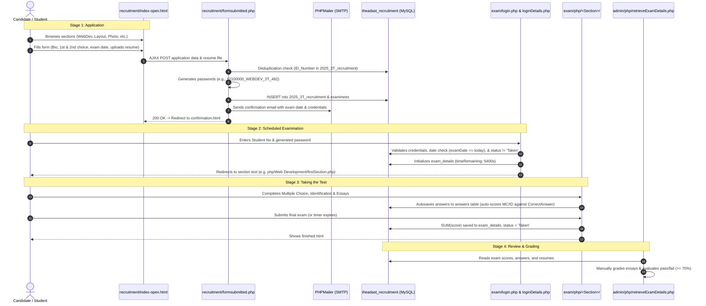

### Overview of the `join` Directory

The [`join/`](file:///Users/lei/Downloads/adastra/manualtest/join) directory serves as the **official Recruitment and Applicant Examination Portal** for **Ad Astra** (the official student yearbook organization of De La Salle-College of Saint Benilde / DLS-CSB).

Across the codebase, `join/` contains three distinct architectural generations:
1. **Legacy Recruitment (2016–2017)**: Root PHP scripts ([`home.php`](file:///Users/lei/Downloads/adastra/manualtest/join/home.php), [`submission_form2017.php`](file:///Users/lei/Downloads/adastra/manualtest/join/submission_form2017.php), [`add_submission2017.php`](file:///Users/lei/Downloads/adastra/manualtest/join/add_submission2017.php), [`checkMissingApplicants.php`](file:///Users/lei/Downloads/adastra/manualtest/join/checkMissingApplicants.php)).
2. **Intermediate Redirect (2021)**: [`index.php`](file:///Users/lei/Downloads/adastra/manualtest/join/index.php) redirecting visitors to `http://join.theadastra.org/2021/index.html`.
3. **Current Active Recruitment & Examination Platform (2024–2026)**:
   - **Application & Landing**: [`join/recruitment/`](file:///Users/lei/Downloads/adastra/manualtest/join/recruitment)
   - **Online Testing Platform**: [`join/exam/`](file:///Users/lei/Downloads/adastra/manualtest/join/exam)

---

### Key Components & What They Do

```
join/
├── index.php                      # HTTP redirect to recruitment landing
├── recruitment/                   # Candidate application funnel
│   ├── index.html                 # "Applications Closed" holding page
│   ├── index-open.html            # Public landing with position descriptions & form
│   ├── forms.html                 # Dedicated multi-step applicant submission form
│   ├── formsubmitted.php          # Backend processor: DB insert, password gen, email dispatch
│   └── confirmation.html          # Success acknowledgement page
└── exam/                          # Online timed examination portal
    ├── login.php                  # Applicant authentication page
    ├── loginDetails.php           # Exam credential validator, date checker & session initiator
    ├── recruitmentexam/           # Instructions, candidate hub & exam submission handler
    │   ├── index.html             # Exam hub & navigation
    │   ├── submit.php             # Final score aggregator & exam completion recorder
    │   └── finished.html          # Completion acknowledgment
    └── php/                       # Department exam engines (Art & Design, Web Dev, Marketing, etc.)
        ├── connect.php            # MySQL DB connection
        ├── include.php            # Shared exam components (timers, question loaders, UI widgets)
        └── Web Development/       # Section-specific questions & autosave submit handlers
```

---

### What It Connects To

#### 1. Database Connections
Both the recruitment form and the examination engine connect to the MySQL database:
- **Host**: `localhost`
- **User**: `theadast_jad`
- **Database**: `theadast_recruitment` (configured in [`join/recruitment/formsubmitted.php`](file:///Users/lei/Downloads/adastra/manualtest/join/recruitment/formsubmitted.php#L52), [`join/exam/php/connect.php`](file:///Users/lei/Downloads/adastra/manualtest/join/exam/php/connect.php#L2), and [`join/exam/loginDetails.php`](file:///Users/lei/Downloads/adastra/manualtest/join/exam/loginDetails.php#L8))

#### 2. Database Schema & Tables

| Table | Purpose | Key Fields |
|---|---|---|
| **`2025_3T_recruitment`** | Stores submitted candidate profiles & application answers | `Applicant_ID`, `ID_Number`, `Last_Name`, `First_Name`, `Pronoun`, `Course_Program`, `Contact_Number`, `Email_Address`, `Resume`, `Portfolio`, `Terms_Left`, `First_Choice`, `Second_Choice`, `Exam_Day_1`, `Exam_Day_2`, `Message` |
| **`examinees`** | Holds generated exam access credentials per applicant choice | `studentNo`, `password`, `term` (e.g. `'3T'`), `academicYear` (e.g. `'25-26AY'`), `choice` (`'First Choice'` / `'Second Choice'`), `section`, `examDate` |
| **`exam_details`** | Tracks test session lifecycle, duration, and completion status | `studentNo`, `section`, `score`, `status` (`'Not Taken'` / `'Taken'`), `timeRemaining` (default 5400s / 90 min), `date_Started`, `date_End` |
| **`questions`** | Question bank categorized by department and question type | `QuestionID`, `Question`, `QuestionType` (`MultipleChoice`, `Identification`, `CodeCheck`, `LongEssay`), `Section`, `points`, `CorrectAnswer`, `Images` |
| **`choices`** | Multiple choice options tied to `questionId` | `choiceId`, `questionId`, `choice` |
| **`answers`** | Stores candidate submissions and per-question score | `studentNo`, `questionId`, `section`, `answer`, `score`, `date_Created` |
| **`logs`** | Security and activity audit trail | Login attempts, timestamps, answer submissions, time limit violations |

#### 3. Mail Infrastructure
- Integrates with **PHPMailer** ([`PHPMailer/`](file:///Users/lei/Downloads/adastra/manualtest/PHPMailer)) via authenticated SMTP:
  - **Host**: `theadastra.org` (Port 465 with SSL/SMTPS)
  - **Username**: `no-reply@theadastra.org`
  - **Reply-To**: `adastra.recruitmentapplications@gmail.com`
  - Automatically dispatches HTML emails with the applicant's test schedules, system credentials, and step-by-step interview guidelines.

#### 4. Admin Management Integration
- Exam results and applicant details connect directly to the administrative panel located at [`admin/php/retrieveExamDetails.php`](file:///Users/lei/Downloads/adastra/manualtest/admin/php/retrieveExamDetails.php). Section editors and managers use this to view test scores, review essay answers, inspect candidate image submissions, and assign scores.

---

### Complete User Flow & Lifecycle



---

### Summary of System Strengths & Vulnerabilities

- **Strict Timing & Date Gates**: [`loginDetails.php`](file:///Users/lei/Downloads/adastra/manualtest/join/exam/loginDetails.php#L32-L33) prevents candidates from accessing questions before their scheduled date or after the date has passed.
- **Auto-Grading**: Multiple choice and identification questions are automatically scored against `questions.CorrectAnswer` upon submission.
- **Audit Logging**: Every login attempt, question answered, and time overrun is timestamped into the `logs` table.
- **Security Notice**: Credentials (`theadast_jad` and SMTP passwords) are hardcoded directly in script files rather than isolated in environment variables. If upgrading or migrating this folder, moving these credentials into a central configuration file (e.g. `config/db_config.php`) is recommended.
